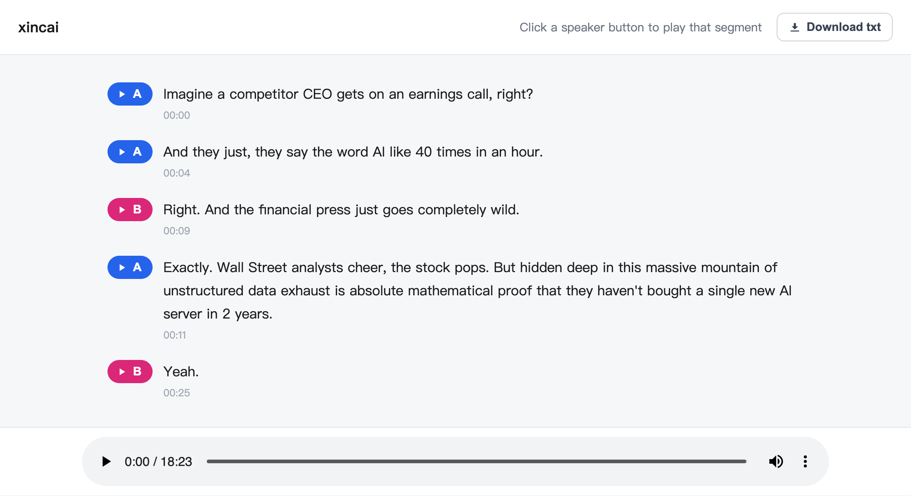

# Speaker Transcript

Turn any recording into a **speaker-separated, clickable transcript** — every sentence
labelled by speaker, with a play button that jumps straight to that moment in the audio,
plus a one-click plain-text export.

Same idea as Feishu Miaoji / Otter, but it's ~250 lines you own and run yourself.



**[▶ Try the live demo](https://xcai2.github.io/speaker-transcript/)** — runs entirely in your
browser with your own API key.

---

## Two ways to use it

### 1. The web page (no install)

Open the [live demo](https://xcai2.github.io/speaker-transcript/), paste your own AssemblyAI
API key, drop in a file. Everything happens in your browser: the audio goes straight from
your machine to AssemblyAI, and the key is kept in your browser's local storage. Nothing is
sent to any server of mine — there is no server.

### 2. The Python script (batch / local files)

Better for long recordings and for keeping transcripts alongside your audio. It writes a
self-contained `<name> - transcript.html` next to the source file.

```bash
git clone https://github.com/xcai2/speaker-transcript.git
cd speaker-transcript

python3 -m venv .venv
.venv/bin/pip install -r requirements.txt

cp .env.example .env      # then put your key in .env

.venv/bin/python transcribe.py "your-recording.m4a"
```

Open the generated HTML in a browser. **Download txt** in the top right saves the plain text.

## Getting an API key

Both paths use [AssemblyAI](https://www.assemblyai.com/dashboard/signup) for transcription and
speaker diarization. Sign up, copy the key from the dashboard, and use **your own** key —
the demo page never ships with one.

## Notes

- **Re-runs are free.** The raw transcript is embedded in the generated HTML, so running the
  script again on the same file rebuilds the page from that data instead of paying to
  transcribe twice. Delete the HTML to force a fresh transcription.
- **Chinese is handled.** AssemblyAI treats each Han character as a separate word; the script
  strips the spaces back out so the text reads normally. Works for English and mixed audio too.
- **Sentence splitting** happens on end-of-sentence punctuation or an 800 ms pause, so rows
  stay short enough to be clickable rather than one wall of text per speaker turn.
- Up to six speakers get distinct colours (A–F).

## Files

| File | What it is |
|---|---|
| `transcribe.py` | The CLI script — transcribe a local file, write the HTML page |
| `index.html` | The browser demo — upload UI, same output, bring your own key |
| `docs/screenshot.png` | The screenshot above |

## License

MIT
