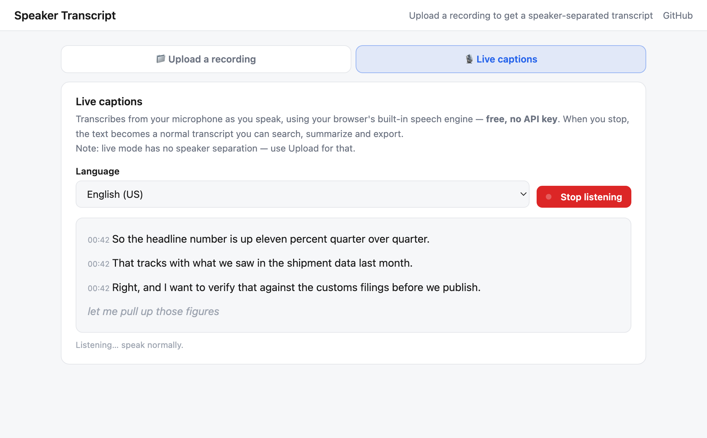

# Speaker Transcript

**The transcript tool for recordings you can't upload to a cloud service.**

Turn any recording into a speaker-separated, searchable transcript — every sentence labelled
by speaker, each one clickable to play that exact moment, with AI summaries and export to
text, Markdown, subtitles or JSON. Or switch to **live captions** and transcribe straight
from your microphone, free and with no API key.

It runs **entirely in your browser** with **your own API key**. Your audio goes straight from
your machine to the transcription provider you chose. There is no server in the middle,
because there is no server.


**[▶ Try it](https://xcai2.github.io/speaker-transcript/)** · no signup, no account, no upload to me

---

## Why this instead of Otter or 飞书妙记

| | Otter / Feishu Miaoji | This |
|---|---|---|
| Your audio | Uploaded to their servers | **Never leaves your browser** except to the API you chose |
| Account | Required | **None** |
| Cost | Free tier, then ~$17/mo | **~$0.15–0.27 per hour** of audio, paid to AssemblyAI directly |
| Chinese + English | One is usually weak | **Both handled properly** |
| Your data | Their retention policy | **Yours. Nothing is stored.** |
| Summary model | Whatever they picked | **Any model you like** — GPT, Claude, DeepSeek, Kimi, Doubao, Qwen, local |

If you work with confidential recordings — legal, medical, HR, research under IRB, anything
under NDA — cloud transcription is usually off the table. That's the gap this fills.

## Features

- **Two modes** — upload a file for speaker-separated transcripts, or live captions from your mic
- **Live captions** — real-time transcription in 10 languages using the browser's own speech
  engine. Free, no API key, nothing uploaded. Stop, and it becomes a normal transcript you can
  search, summarize and export.
- **Speaker separation** — up to six speakers, colour-coded
- **Click any line to play it** — jumps straight to that moment
- **Rename speakers** — "Speaker A" → "Sarah", updates everywhere including exports
- **Search** — filter and highlight across the whole transcript
- **AI summary** — abstract, key points, and action items with owners and timestamps
- **Talk-time breakdown** — who actually dominated the meeting
- **Export** — `.txt`, `.md`, `.srt`, `.vtt`, `.json`
- **Bilingual** — proper Chinese segmentation, not one space between every character

## Two ways to use it

### The web page — nothing to install

Open the [demo](https://xcai2.github.io/speaker-transcript/) and pick a mode:

**📁 Upload a recording** — paste your AssemblyAI key into Settings, then drop in a file.
Gives you speaker separation and the highest accuracy.

**🎙 Live captions** — click Start listening and talk. No key, no cost. No speaker separation
in this mode, and note that browsers implement this by sending audio to their own speech
service (Google's, in Chrome) — so for confidential material, use Upload mode instead.



Optionally add a model provider key for AI summaries in either mode.

### The Python script — for batch and long files

Writes a self-contained `<name> - transcript.html` next to your audio.

```bash
git clone https://github.com/xcai2/speaker-transcript.git
cd speaker-transcript

python3 -m venv .venv
.venv/bin/pip install -r requirements.txt

cp .env.example .env      # add your key
.venv/bin/python transcribe.py "your-recording.m4a"
```

## Getting keys

**Transcription (required)** — [AssemblyAI](https://www.assemblyai.com/dashboard/signup).
Free credit to start, then roughly $0.15–0.27 per hour of audio.

**Summaries (optional)** — any one of:

| Provider | Get a key |
|---|---|
| OpenAI | [platform.openai.com](https://platform.openai.com/api-keys) |
| Anthropic (Claude) | [console.anthropic.com](https://console.anthropic.com/settings/keys) |
| DeepSeek | [platform.deepseek.com](https://platform.deepseek.com/api_keys) |
| Kimi 月之暗面 | [platform.moonshot.cn](https://platform.moonshot.cn/console/api-keys) |
| Doubao 豆包 | [Volcengine Ark](https://console.volcengine.com/ark) |
| Qwen 通义千问 | [Bailian](https://bailian.console.aliyun.com/) |
| Anything OpenAI-compatible | Ollama, vLLM, LM Studio, OpenRouter — pick **Custom** and set the base URL |

Keys live in your browser's `localStorage` and are sent only to that provider.

## Notes

- **Re-runs are free.** The raw transcript is embedded in the generated HTML, so re-running
  the script rebuilds the page from that data instead of transcribing twice. Delete the HTML
  to force a fresh run.
- **Chinese is handled.** AssemblyAI treats each Han character as its own word; the spaces are
  stripped back out. Verified byte-identical between the Python and browser implementations.
- **Sentence splitting** on end-of-sentence punctuation or an 800 ms pause, so rows stay short
  enough to click instead of being one wall of text per speaker turn.
- **No build step.** Plain ES modules — clone it and open `index.html`.

## Recording responsibly

Recording laws vary, and some places require **everyone** on the call to consent. See
**[LEGAL.md](LEGAL.md)** for a jurisdiction breakdown and practical guidance. You are
responsible for having the right to record and process any audio you use here.

## Files

| File | What it is |
|---|---|
| `index.html` | The web app |
| `app.js` | Upload, transcription, rendering, search, summary |
| `live.js` | Live captions via the Web Speech API |
| `transcript.js` | Sentence splitting and every export format |
| `llm.js` | Model provider clients |
| `transcribe.py` | The CLI version |
| `LEGAL.md` | Recording law and privacy |

## License

MIT
